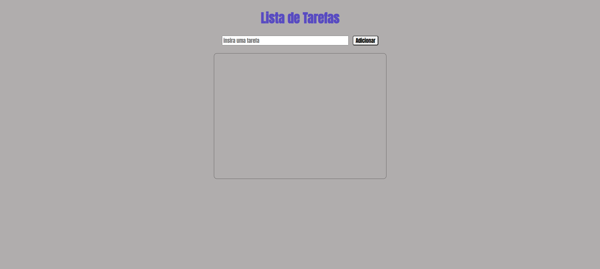
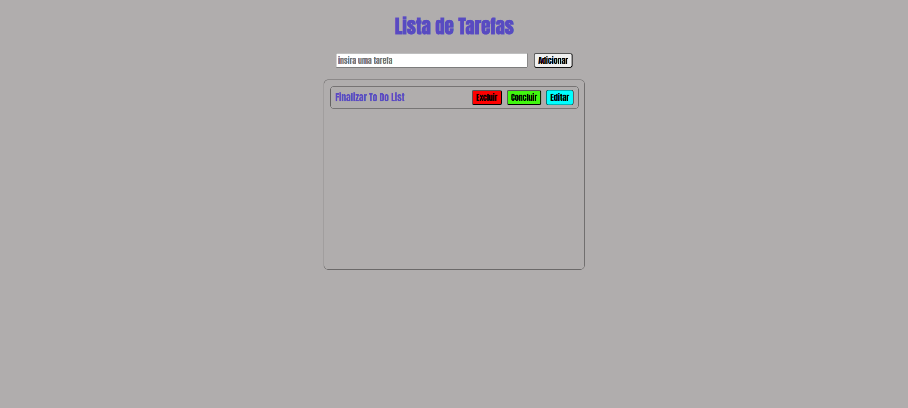
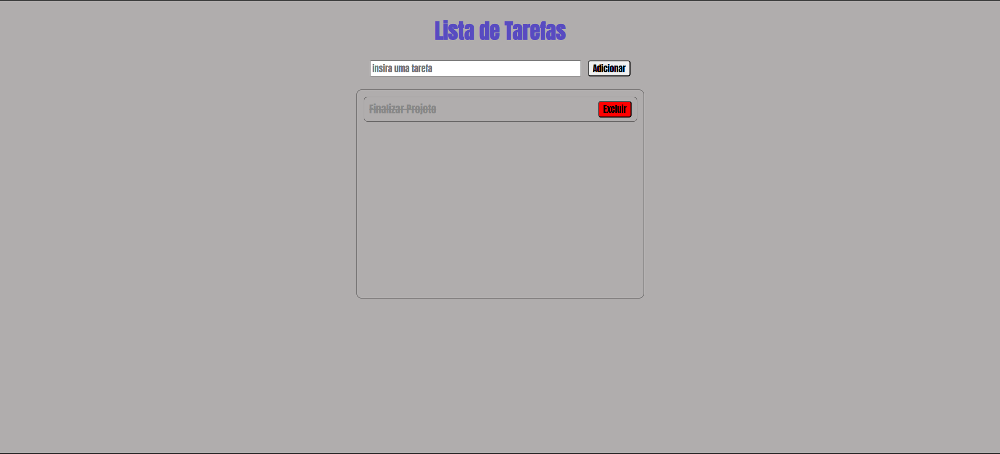

# To-Do-List-PHP-MySQL

Lista de afazeres afim de entregar uma melhor organização para o dia a dia dos usuários. No momento, com ela é possível: 

* Adicionar uma tarefa;
* Editar uma tarefa;
* Excluir uma tarefa;

## Tecnologias utilizadas (até o momento):
* PHP versão 8.3.6
* MySQL
* HTML

## Desafio
Desenvolver habilidades para criar conexão entre uma página web e banco de dados criando uma aplicação funcional.

## Página Inicial

## Adicionar Tarefa

## Editar Tarefa

## Concluir Tarefa
  

## Autor
[Fernando Maia](https://github.com/fersmaia10)
